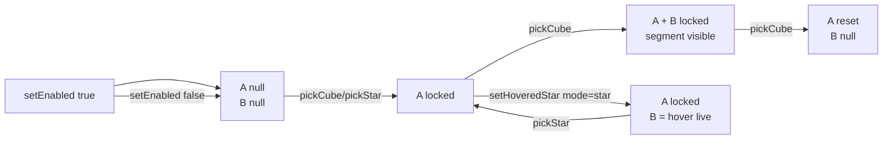

# MeasureTool

::: tip Composition sandbox
Comme [PaintSelection](./paint-selection), `MeasureTool` vit dans `playground/` — c'est une composition spécifique au sandbox qui s'appuie sur [`worldUnitsToLightYears`](../api/astronomy) (lib) pour la conversion de distance.
:::

Outil de mesure à deux ancres. En orbite il mesure des **centres de cubes** ; dans une vue close-up il mesure des **étoiles individuelles**. La distance est convertie en années-lumière (1 cube = 50 al) et affichée sur le segment.

## Signature

```ts
import { createMeasureTool } from 'galex-js/playground/MeasureTool';

createMeasureTool(): MeasureTool;

type MeasureTool = {
  readonly object3D: THREE.Group;
  setEnabled(enabled: boolean): void;
  isEnabled(): boolean;

  // Cube↔cube — utilisé en orbite / plan view
  pickCube(galaxy: GalaxyData, cube: Cube): void;

  // Étoile↔étoile — utilisé en close-up
  pickStar(galaxy: GalaxyData, starIndex: number): void;

  // Live B en mode étoile : suit le hover
  setHoveredStar(galaxy: GalaxyData, starIndex: number | null): void;

  clear(): void;
  setResolution(width: number, height: number): void;  // resize fenêtre
  dispose(): void;
};
```

## Geste utilisateur

### Mode `cube` (orbite, plan view)

1. **Premier clic** sur un cube → l'ancre A se verrouille
2. **Deuxième clic** sur un autre cube → l'ancre B se verrouille, le segment + le label apparaissent
3. **Troisième clic** sur un cube → l'ancre A se réinitialise sur ce cube, B redevient libre

### Mode `star` (close-up)

1. **Clic** sur une étoile → A se verrouille
2. **Hover** sur d'autres étoiles → B suit le pointeur en live, la distance se met à jour à chaque frame
3. **Re-clic** sur une étoile → A bascule sur la nouvelle, B redevient libre

Cliquer A puis hover sur A elle-même donne un segment dégénéré (0 al) — le composable masque alors le segment et le label.

## Architecture



### Auto-switch de mode + clear

Mélanger les deux modes (un cube en A et une étoile en B, par exemple) serait ambigu — les coordonnées ne vivent pas dans le même espace conceptuel. Donc :

```ts
function switchMode(next: MeasureMode): void {
  if (mode !== null && mode !== next) clear();
  mode = next;
  applyMarkerLook();
}
```

Sortir d'un close-up qui était en mode étoile : le caller appelle `setHoveredStar(galaxy, null)` puis, à la prochaine sélection cube, le `switchMode('cube')` purge l'ancre étoile au passage.

### Look par mode

Les deux ancres partagent les mêmes sphères, juste re-stylées :

| Mode | Échelle | Opacité | Pourquoi |
|---|---|---|---|
| `cube` | 1.00 | 0.90 | Bille solide centrée dans le cube — lisible à distance d'orbite |
| `star` | 0.55 | 0.35 | Halo doux qui colle au sprite stellaire — le hover ring du close-up porte déjà l'identification |

Le marqueur B est masqué entièrement en mode étoile (on n'a pas deux halos sur la même étoile : le hover ring du close-up + le marqueur de mesure feraient doublon).

### Ancres : `id` + position

Chaque ancre est `{ id: string; center: Vector3 }`. L'`id` (`cube:i,j,k` ou `star:globalIdx`) permet le test « même cible que la précédente ? » sans comparer trois flottants. La position est calculée une fois et stockée — pas de recalcul par frame.

### Distance → années-lumière

Le segment monde-unités est converti via [`worldUnitsToLightYears(cubeSize, distWorld)`](../api/astronomy). Le `cubeSize` vient de `GalaxyData.opts`, donc une régen avec un cubeSize différent reste cohérente (en pratique le sandbox fixe `cubeSize = 2`, mais la conversion est paramétrique).

```ts
function formatDistance(cubeSize: number, distanceWorld: number): string {
  const ly = Math.round(worldUnitsToLightYears(cubeSize, distanceWorld));
  return `${ly.toLocaleString('fr-FR')} al`;
}
```

### Parenté `galaxyScene.object3D`

L'outil est rattaché à `galaxyScene.object3D` côté playground — comme ça il **hérite de la rotation idle** de la galaxie. Les ancres restent collées aux cubes pendant que le disque tourne lentement.

Sur regen, la galaxie est rebuild → l'ancien `galaxyScene` est disposé. Le pattern utilisé : `scene.attach(measureTool.object3D)` avant le tear-down (le tool migre temporairement dans la scène racine), puis on le ré-attache au nouveau `galaxyScene` après le rebuild. Le `clear()` est appelé entre les deux : les indices stellaires de l'ancienne galaxie sont obsolètes.

```ts
// Au déclenchement de la régen :
scene.attach(measureTool.object3D);
regenerate();

// Dans setCurrentWorld après le rebuild :
measureTool.clear();
w.galaxyScene.object3D.add(measureTool.object3D);
```

## Exemple d'intégration

Extrait de [`playground/Main.ts`](https://github.com/cedric-pouilleux/galex-js/blob/main/playground/Main.ts) :

```ts
const measureTool = createMeasureTool();
currentWorld.galaxyScene.object3D.add(measureTool.object3D);
measureTool.setResolution(window.innerWidth, window.innerHeight);

// Toggle UI
toggleMeasureEl.addEventListener('change', () => {
  measureTool.setEnabled(toggleMeasureEl.checked);
});

// Sur clic en orbite — pickCube si le mode mesure est actif
function handleCanvasClick() {
  const { closeup, galaxyData } = currentWorld;

  if (closeup.isActive()) {
    if (!measureTool.isEnabled()) return;
    const star = closeup.starAtPointer(picker.pointer);
    if (star) measureTool.pickStar(galaxyData, star.globalIndex);  // ← star mode
    return;
  }

  const cube = picker.pickCube(activeCamera(), galaxyScene.object3D, galaxyData.grid);
  if (!cube || fog.status(cube, player) !== 'visible') return;
  if (measureTool.isEnabled()) {
    measureTool.pickCube(galaxyData, cube);                        // ← cube mode
    return;
  }
  // … sinon ouvrir le close-up
}

// Hover en close-up — feed le B dynamique
function updateCloseupHover(/* ... */) {
  const star = closeup.starAtPointer(picker.pointer);
  if (star) measureTool.setHoveredStar(galaxyData, star.globalIndex);
  // …
}

// Resize fenêtre — re-projection des lignes épaisses
window.addEventListener('resize', () => {
  measureTool.setResolution(window.innerWidth, window.innerHeight);
});
```

## `globalIndex` et la sélection multi-cubes

En close-up, le raycast renvoie un `index` local au champ d'étoiles fusionné (cf. [`CloseupField`](./closeup#multi-cubes)). `MeasureTool.pickStar` et `setHoveredStar` attendent un index **global** — c'est `field.globalIndices[localIdx]`, exposé par `Closeup.starAtPointer().globalIndex`. Cette traduction est ce qui permet à la mesure étoile↔étoile de fonctionner même quand on est en close-up multi-cubes.

## Pourquoi le tooling vit côté playground ?

Le concept « mesurer une distance entre deux choses » dépend du jeu :

| Décision | Place |
|---|---|
| Format de l'affichage (al, parsecs, années lumière + symbole) | ❌ caller (UX) |
| Quoi peut être ancre (cube ? étoile ? flotte ? planète ?) | ❌ caller (domaine) |
| Combien d'ancres (2 ici, mais un planificateur de route en voudrait N) | ❌ caller (UX) |
| Look des marqueurs et de la ligne | ❌ caller (charte graphique) |
| Conversion monde → unités astronomiques (`worldUnitsToLightYears`) | ✅ lib (`core/Astronomy`) |
| Indexation cube spatiale (`CubeGrid.cubeToWorldCenter`) | ✅ lib (`core/CubeGrid`) |
| Buffers stellaires (`galaxy.data.positions`) | ✅ lib (`core/GalaxyData`) |

Un jeu MMO 4X qui veut un planificateur de route en N étapes consomme les mêmes briques lib et écrit son propre `RoutePlanner` à la place de `MeasureTool`.
