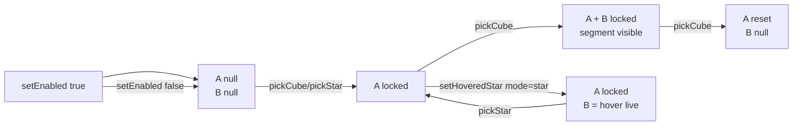

# MeasureTool

::: tip Composition sandbox
Comme [RectSelection](./rect-selection), `MeasureTool` vit dans `playground/` — c'est une composition spécifique au sandbox qui s'appuie sur [`worldUnitsToLightYears`](../api/astronomy) (lib) pour la conversion de distance.
:::

Outil de mesure à deux ancres. En orbite il mesure des **centres de cubes** ; dans une vue close-up il mesure des **étoiles individuelles** selon deux sous-modes :

- **Directe** — segment droit A → B, B suit le hover en live.
- **Trajet par étoiles** — chemin multi-sauts calculé par [`findStarPath`](../api/pathfinding), borné par une portée de saut configurable (modélise un niveau de moteur subluminique). Affiche chaque escale et la distance totale.

La distance est convertie en années-lumière (1 cube = 50 al) et affichée sur le segment ou le polyline.

## Signature

```ts
import { createMeasureTool } from 'galex-js/playground/MeasureTool';

createMeasureTool(opts?: MeasureToolOptions): MeasureTool;

type MeasureToolOptions = {
  onPathComputed?:    (cubes: readonly Cube[]) => void;        // path résolu
  onPathCleared?:     () => void;                              // path invalidé
  isStarMeasurable?:  (starIndex: number) => boolean;          // filtre (fog…)
  onFocusTrajectory?: (info: TrajectoryInfo) => void;          // touche Espace
  focusKey?:          string;                                  // défaut ' '
};

type TrajectoryInfo = {
  cubes: readonly Cube[];     // cubes traversés (route order, dedup)
  distance: number;           // unités monde — al = worldUnitsToLightYears(cubeSize, …)
  hops: number;               // 1 en direct, stars.length - 1 en path
  stars: readonly number[];   // indices globaux (path mode), [] sinon
  longestJump: number;        // unités monde
};

type MeasureTool = {
  readonly object3D: THREE.Group;
  setEnabled(enabled: boolean): void;
  isEnabled(): boolean;

  // Cube↔cube — orbite / plan view
  pickCube(galaxy: GalaxyData, cube: Cube): void;

  // Étoile↔étoile — close-up (sous-mode pilote)
  pickStar(galaxy: GalaxyData, starIndex: number): void;
  setHoveredStar(galaxy: GalaxyData, starIndex: number | null): void;

  setStarMode(starMode: 'direct' | 'path'): void;
  starMode(): 'direct' | 'path';

  setPathRangeLightYears(galaxy: GalaxyData, lightYears: number): void;
  pathRangeLightYears(): number;

  /** Snapshot du trajet courant — `null` si la mesure n'est pas complète. */
  currentTrajectory(galaxy: GalaxyData): TrajectoryInfo | null;

  clear(): void;
  setResolution(width: number, height: number): void;
  dispose(): void;
};
```

## Geste utilisateur

### Mode `cube` (orbite, plan view)

1. **Premier clic** sur un cube → l'ancre A se verrouille
2. **Deuxième clic** sur un autre cube → l'ancre B se verrouille, le segment + le label apparaissent
3. **Troisième clic** sur un cube → l'ancre A se réinitialise sur ce cube, B redevient libre

### Mode `star` (close-up, sous-mode `direct`)

1. **Clic** sur une étoile → A se verrouille
2. **Hover** sur d'autres étoiles → B suit le pointeur en live, la distance se met à jour à chaque frame
3. **Re-clic** sur une étoile → A bascule sur la nouvelle, B redevient libre

Cliquer A puis hover sur A elle-même donne un segment dégénéré (0 al) — le composable masque alors le segment et le label.

### Mode `path` (close-up, sous-mode `path`)

1. **Premier clic** sur une étoile → A se verrouille
2. **Deuxième clic** sur une autre étoile → B se verrouille, [`findStarPath`](../api/pathfinding) calcule le trajet : chaque escale reçoit une petite bille, l'ensemble est relié par un polyline pointillé continu, le label affiche `total al · N sauts`
3. **Troisième clic** sur une étoile → A bascule sur la nouvelle, B redevient libre

Si aucun trajet n'existe pour la portée configurée, l'outil dessine un segment droit **rouge** A → B avec un label "hors de portée" — l'utilisateur voit immédiatement qu'il doit augmenter la portée de son moteur (ou choisir une étape intermédiaire).

Le hover n'a aucun effet en sous-mode `path` (les deux ancres sont verrouillées explicitement).

### Focus trajet (touche `Espace`)

`MeasureTool` enregistre lui-même un `window.addEventListener('keydown')` — le caller n'a pas à câbler la touche. Quand la mesure est complète (A + B verrouillés, ou trajet `path` résolu), la pression sur `Espace` (ou la touche passée via `focusKey`) appelle le callback `onFocusTrajectory(info)` que le caller a fourni :

```ts
const measureTool = createMeasureTool({
  onFocusTrajectory: (info) => {
    if (closeup.isActive()) closeup.refocus(info.cubes);
    else openCloseupForCubes(info.cubes);
  },
});
```

Garde-fous intégrés :
- Aucun effet si la mesure n'est pas complète (`currentTrajectory()` renvoie `null`).
- Aucun effet si le focus DOM est sur un `<input>` / `<button>` / `<select>` / `<textarea>` — la touche garde son comportement natif (ex: cocher une checkbox).
- Aucun effet si la touche est différente de `focusKey`, ou si le tool est désactivé.
- Omettre `onFocusTrajectory` désactive la touche entièrement.

`Escape` reste géré côté caller (ferme le close-up actif).

L'API qui alimente ce geste est `trajectCubes(galaxy)` :

| Mode | Cubes retournés |
|---|---|
| `cube` (A + B verrouillés) | `[cubeA, cubeB]` |
| `star` direct (A + B locked ou hover) | cubes qui hébergent les deux étoiles |
| `path` (résolu) | cubes traversés par `findStarPath`, dédupliqués dans l'ordre du trajet |
| `path` (hors de portée) | fallback A↔B straight line — mêmes 2 cubes que pour le mode `cube` |
| A seul / pas de B | `[]` (la touche est ignorée) |

Le close-up est ouvert via le même point d'entrée que la sélection rectangulaire ou le clic single-cube — l'utilisateur peut sortir avec `Escape`.

### Live re-route sur changement de portée

Une fois A et B verrouillés en sous-mode `path`, modifier la portée via `setPathRangeLightYears` **recalcule immédiatement** le trajet — c'est ce qui rend le slider sandbox réactif (l'utilisateur voit le nombre de sauts grimper / chuter en temps réel).

### Lire le trajet courant

Pour alimenter un HUD, valider une action ou persister une route, le caller appelle `currentTrajectory(galaxy)` à la demande — pas besoin de tracker l'état interne :

```ts
const info = measureTool.currentTrajectory(galaxyData);
if (info) {
  const totalLy = worldUnitsToLightYears(galaxyData.opts.cubeSize, info.distance);
  hud.setRoute({
    totalLy: Math.round(totalLy),
    hops: info.hops,
    longestJumpLy: worldUnitsToLightYears(galaxyData.opts.cubeSize, info.longestJump),
    stars: info.stars,    // indices globaux — utile pour persister une route
  });
}
```

| Champ | Cube mode | Star direct | Path mode |
|---|---|---|---|
| `cubes` | `[cubeA, cubeB]` (dédup) | cubes hébergeant A et B | cubes traversés par `findStarPath` |
| `distance` | distance A↔B (unités monde) | idem | somme des hops |
| `hops` | `1` | `1` | `stars.length - 1` |
| `stars` | `[]` | `[]` | indices globaux en route order |
| `longestJump` | `= distance` | `= distance` | plus long hop du chemin |

Renvoie `null` si la mesure n'est pas complète (A seul, B masqué en hover…).

### Overlay trajet sur le close-up

Quand un trajet sort du cube initialement inspecté, les escales tombent dans des cubes voisins que le close-up ne rend pas — visuellement, les rings d'escale flottent dans du vide dimmé.

`MeasureTool` expose deux callbacks pour synchroniser le sous-buffer du close-up avec la trajectoire courante :

| Callback | Quand | Effet attendu |
|---|---|---|
| `onPathComputed(cubes)` | Trajet `path` résolu (`findStarPath` réussit) | Le caller appelle `closeup.setTrajectoryCubes(cubes)` → le sous-buffer haute fidélité est **remplacé** par les cubes du trajet. Tout ce qui était highlight avant (trajet précédent, marquee, etc.) retombe au dim de la galaxie. |
| `onPathCleared()` | Trajet `path` invalidé : 3e clic qui reset, sortie du mode `path`, `clear()`, `setEnabled(false)` | Le caller appelle `closeup.setTrajectoryCubes([])` → le close-up revient à ses cubes initiaux (passés à `enter()`). |

```ts
const measureTool = createMeasureTool({
  onPathComputed: (cubes) => closeup.isActive() && closeup.setTrajectoryCubes(cubes),
  onPathCleared:  ()      => closeup.isActive() && closeup.setTrajectoryCubes([]),
});
```

[`Closeup.setTrajectoryCubes`](./closeup#settrajectorycubes) **remplace** le sous-buffer (sémantique "set", pas "add") — c'est ce qui garantit qu'un trajet précédent ne reste pas highlight dans le buffer après une nouvelle mesure. Conséquence assumée : pour une marquee multi-cube, dès qu'un trajet est calculé, les cubes hors trajet disparaissent du HD ; sortir de la mesure (`onPathCleared`) les fait revenir.

### Filtre fog of war

Quand le fog est actif, les étoiles hébergées par des cubes non-`visible` ne peuvent pas participer à une mesure. Le caller injecte un prédicat `isStarMeasurable(starIndex)` :

```ts
const measureTool = createMeasureTool({
  isStarMeasurable: (idx) => {
    const { positions } = galaxyData.data;
    const { grid } = galaxyData;
    const { i, j, k } = grid.worldToCube(positions[idx*3], positions[idx*3+1], positions[idx*3+2]);
    return fog.status(grid.get(i, j, k), player) === 'visible';
  },
});
```

Effets :
- `pickStar` ignore silencieusement un clic sur une étoile filtrée (pas de lock d'ancre).
- `setHoveredStar` masque la live B si l'étoile sous le curseur est filtrée.
- `findStarPath` reçoit le prédicat via [`isStarAllowed`](../api/pathfinding#options) — les étoiles filtrées sont retirées du graphe (escales **et** endpoints), donc un trajet n'inclura jamais une étoile dans un cube caché.

## Architecture



### Auto-switch de mode + clear

Mélanger les deux modes (un cube en A et une étoile en B, par exemple) serait ambigu — les coordonnées ne vivent pas dans le même espace conceptuel. Donc :

```ts
function switchMode(next: MeasureMode): void {
  if (mode !== null && mode !== next) clear();
  mode = next;
  applyMarkerLook();
}
```

Sortir d'un close-up qui était en mode étoile : le caller appelle `setHoveredStar(galaxy, null)` puis, à la prochaine sélection cube, le `switchMode('cube')` purge l'ancre étoile au passage.

### Look par mode

Les deux ancres partagent les mêmes sphères, juste re-stylées :

| Mode | Échelle | Opacité | Pourquoi |
|---|---|---|---|
| `cube` | 1.00 | 0.90 | Bille solide centrée dans le cube — lisible à distance d'orbite |
| `star` | 0.55 | 0.35 | Halo doux qui colle au sprite stellaire — le hover ring du close-up porte déjà l'identification |

Le marqueur B est masqué entièrement en mode étoile (on n'a pas deux halos sur la même étoile : le hover ring du close-up + le marqueur de mesure feraient doublon).

### Ancres : `id` + position

Chaque ancre est `{ id: string; center: Vector3 }`. L'`id` (`cube:i,j,k` ou `star:globalIdx`) permet le test « même cible que la précédente ? » sans comparer trois flottants. La position est calculée une fois et stockée — pas de recalcul par frame.

### Distance → années-lumière

Le segment monde-unités est converti via [`worldUnitsToLightYears(cubeSize, distWorld)`](../api/astronomy). Le `cubeSize` vient de `GalaxyData.opts`, donc une régen avec un cubeSize différent reste cohérente (en pratique le sandbox fixe `cubeSize = 2`, mais la conversion est paramétrique).

```ts
function formatDistance(cubeSize: number, distanceWorld: number): string {
  const ly = Math.round(worldUnitsToLightYears(cubeSize, distanceWorld));
  return `${ly.toLocaleString('fr-FR')} al`;
}
```

### Parenté `galaxyScene.object3D`

L'outil est rattaché à `galaxyScene.object3D` côté playground — comme ça il **hérite de la rotation idle** de la galaxie. Les ancres restent collées aux cubes pendant que le disque tourne lentement.

Sur regen, la galaxie est rebuild → l'ancien `galaxyScene` est disposé. Le pattern utilisé : `scene.attach(measureTool.object3D)` avant le tear-down (le tool migre temporairement dans la scène racine), puis on le ré-attache au nouveau `galaxyScene` après le rebuild. Le `clear()` est appelé entre les deux : les indices stellaires de l'ancienne galaxie sont obsolètes.

```ts
// Au déclenchement de la régen :
scene.attach(measureTool.object3D);
regenerate();

// Dans setCurrentWorld après le rebuild :
measureTool.clear();
w.galaxyScene.object3D.add(measureTool.object3D);
```

## Exemple d'intégration

Extrait de [`playground/Main.ts`](https://github.com/cedric-pouilleux/galex-js/blob/main/playground/Main.ts) :

```ts
const measureTool = createMeasureTool();
currentWorld.galaxyScene.object3D.add(measureTool.object3D);
measureTool.setResolution(window.innerWidth, window.innerHeight);

// Toggle UI
toggleMeasureEl.addEventListener('change', () => {
  measureTool.setEnabled(toggleMeasureEl.checked);
});

// Sur clic en orbite — pickCube si le mode mesure est actif
function handleCanvasClick() {
  const { closeup, galaxyData } = currentWorld;

  if (closeup.isActive()) {
    if (!measureTool.isEnabled()) return;
    const star = closeup.starAtPointer(picker.pointer);
    if (star) measureTool.pickStar(galaxyData, star.globalIndex);  // ← star mode
    return;
  }

  const cube = picker.pickCube(activeCamera(), galaxyScene.object3D, galaxyData.grid);
  if (!cube || fog.status(cube, player) !== 'visible') return;
  if (measureTool.isEnabled()) {
    measureTool.pickCube(galaxyData, cube);                        // ← cube mode
    return;
  }
  // … sinon ouvrir le close-up
}

// Hover en close-up — feed le B dynamique
function updateCloseupHover(/* ... */) {
  const star = closeup.starAtPointer(picker.pointer);
  if (star) measureTool.setHoveredStar(galaxyData, star.globalIndex);
  // …
}

// Resize fenêtre — re-projection des lignes épaisses
window.addEventListener('resize', () => {
  measureTool.setResolution(window.innerWidth, window.innerHeight);
});
```

## `globalIndex` et la sélection multi-cubes

En close-up, le raycast renvoie un `index` local au champ d'étoiles fusionné (cf. [`CloseupField`](./closeup#multi-cubes)). `MeasureTool.pickStar` et `setHoveredStar` attendent un index **global** — c'est `field.globalIndices[localIdx]`, exposé par `Closeup.starAtPointer().globalIndex`. Cette traduction est ce qui permet à la mesure étoile↔étoile de fonctionner même quand on est en close-up multi-cubes.

## Pourquoi le tooling vit côté playground ?

Le concept « mesurer une distance entre deux choses » dépend du jeu :

| Décision | Place |
|---|---|
| Format de l'affichage (al, parsecs, années lumière + symbole) | ❌ caller (UX) |
| Quoi peut être ancre (cube ? étoile ? flotte ? planète ?) | ❌ caller (domaine) |
| Combien d'ancres (2 ici, mais un planificateur de route en voudrait N) | ❌ caller (UX) |
| Look des marqueurs et de la ligne | ❌ caller (charte graphique) |
| Conversion monde → unités astronomiques (`worldUnitsToLightYears`) | ✅ lib (`core/Astronomy`) |
| Indexation cube spatiale (`CubeGrid.cubeToWorldCenter`) | ✅ lib (`core/CubeGrid`) |
| Buffers stellaires (`galaxy.data.positions`) | ✅ lib (`core/GalaxyData`) |

Un jeu MMO 4X qui veut un planificateur de route en N étapes consomme les mêmes briques lib et écrit son propre `RoutePlanner` à la place de `MeasureTool`.
