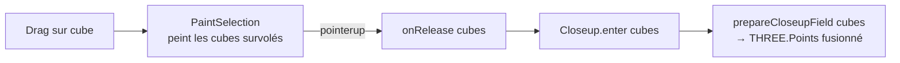

# PaintSelection

::: tip Composition sandbox
Contrairement aux autres primitives de cette section, `PaintSelection` vit dans `playground/` — c'est une **composition** spécifique au sandbox, pas une primitive lib. Le code reste un exemple de référence pour implémenter le même geste dans un jeu MMO 4X ou autre.
:::

Sélection multi-cubes en mode peinture. Le drag démarre sur un cube → le geste appartient à la sélection (pas de rotation orbite, pas de clic-single), et chaque cube survolé est ajouté à la sélection avec son wireframe. Au relâcher, le close-up s'ouvre sur la sélection (cube unique ou multiple).

## Signature

```ts
import { createPaintSelection } from 'stellex-galaxy-sandbox/playground/PaintSelection';

createPaintSelection(deps: PaintSelectionDeps): PaintSelection;

type PaintSelectionDeps = {
  canvas: HTMLElement;
  controls: OrbitControls;        // désactivé pendant le geste
  cubeSize: number;               // taille des wireframes du pool
  parent: THREE.Object3D;         // attache initiale du pool — re-set via setParent
  pickCubeAt: (canvasX, canvasY) => Cube | null;
  cubeCenter: (cube: Cube) => { x: number; y: number; z: number };
};

type PaintSelection = {
  bind(handlers: { onRelease: (cubes: readonly Cube[]) => void }): void;
  setParent(parent: THREE.Object3D): void;  // après regen
  clear(): void;                            // au regen / sur abandon
};
```

## Geste utilisateur

| Action | Effet |
|---|---|
| Clic gauche sur **vide** + drag | Rotation orbite (passe à travers, OrbitControls owns the gesture) |
| Clic gauche sur **cube** + drag | Peinture : chaque cube survolé est highlight |
| Relâcher après peinture | `onRelease(cubes)` — close-up multi-cubes s'ouvre |
| Clic court sur cube (pas de drag) | Toujours géré par `PaintSelection` (1 cube peint) — pas le `Picker.onClick` |

Les deux derniers cas tombent dans le même handler. Le composable suit la logique « si tu commences sur un cube, tu es en mode sélection ».

## Décisions d'architecture

### Capture phase + `stopImmediatePropagation`

Le `pointerdown` du composable est enregistré en **capture phase** (`addEventListener(..., true)`) — il tourne donc avant les handlers en bubble phase d'OrbitControls et de `Picker`.

Si le pointeur descend sur un cube selectable :

1. `controls.enabled = false` — OrbitControls bail au check d'entrée, pas de rotation
2. `e.stopImmediatePropagation()` — `Picker` ne stocke pas `downX/downY/downT`, son `onClick` ne pourra pas fire au relâcher
3. `setPointerCapture(e.pointerId)` — garantit que `pointerup` arrive sur le canvas même si l'utilisateur sort des bords (sinon `active` resterait `true`)

Si le pointeur descend sur du vide, on sort tôt sans toucher à l'événement → OrbitControls + Picker fonctionnent normalement.

### Pool de wireframes

Chaque cube peint reçoit un `LineSegments2` issu d'un pool. Le pool grandit paresseusement et se réutilise entre gestes — pas d'allocation GPU pendant le drag. Le cleanup `endGesture()` cache toutes les wireframes (sans les disposer) pour préparer le geste suivant.

```ts
function slot(index: number) {
  while (index >= pool.length) {
    const wire = createCubeWireframe(cubeSize, HIGHLIGHT_COLOR, { linewidth: 3 });
    pool.push(wire);
    root.add(wire);
  }
  pool[index].visible = true;
  return pool[index];
}
```

### Dedup par `cubeKey`

Le `Map<string, Cube>` interne dédupplique en O(1) via `cubeKey(i, j, k)` — le même cube survolé deux fois dans un drag n'est ajouté qu'une fois, et le wireframe est positionné une fois.

### Highlights cachés avant `onRelease`

Le close-up applique `setDimming(0.03)` à la galaxie. Le wireframe a `depthTest: false` (par défaut de `createCubeWireframe`) — il continuerait donc à percer le dim si on le laissait visible. On cache toutes les highlights avant de notifier le host.

## Cycle de vie

Le composable vit aussi longtemps que la page — il survit aux régénérations de galaxie. Le host appelle :

- `setParent(newGalaxyScene.object3D)` après regen pour ré-attacher le pool sous la nouvelle scène (sinon les wireframes restent orphelins)
- `clear()` si une régénération arrive en plein geste (purge le `Map` et les visuels)

## Exemple d'intégration

Extrait de [`playground/Main.ts`](https://github.com/.../playground/Main.ts) — montre le wiring complet avec le `Picker`, le `Closeup` et le fog of war.

```ts
const paintSelection = createPaintSelection({
  canvas,
  controls,
  cubeSize: currentWorld.galaxyData.opts.cubeSize,
  parent: currentWorld.galaxyScene.object3D,
  pickCubeAt: (x, y) => {
    // Désactivé pendant le close-up et le mode mesure — laisse la place
    // aux gestes correspondants (raycast étoile, sélection cube simple).
    if (currentWorld.closeup.isActive()) return null;
    if (measureTool.isEnabled()) return null;
    const { galaxyScene, galaxyData, player } = currentWorld;
    const cube = picker.pickCubeAt(x, y, activeCamera(), galaxyScene.object3D, galaxyData.grid);
    if (!cube) return null;
    return fog.status(cube, player) === 'visible' ? cube : null;
  },
  cubeCenter: (cube) =>
    currentWorld.galaxyData.grid.cubeToWorldCenter(cube.i, cube.j, cube.k),
});

paintSelection.bind({
  onRelease: openCloseupForCubes,
});
```

Au regen :

```ts
setCurrentWorld: (w) => {
  currentWorld = w;
  paintSelection.setParent(w.galaxyScene.object3D);
},
onRequestRegen: () => {
  paintSelection.clear();
  regenerate();
}
```

## Composition avec le close-up

`PaintSelection.onRelease` fournit `readonly Cube[]` — directement consommable par `Closeup.enter(cubes, …)` côté playground, qui appelle [`prepareCloseupField(cubes, …)`](./closeup#prepareloseupfield) côté lib. La lib fusionne les étoiles en un seul `THREE.Points` et expose `globalIndices` pour traduire un raycast local → index global.



## Pourquoi pas un rectangle de sélection ?

Un rectangle (marquee classique) sélectionne par projection écran — il inclut potentiellement des cubes que le curseur n'a pas touchés visuellement. La peinture est plus proche de l'intention : « ces cubes-là, ceux que j'ai effectivement balayés ». Pas de rectangle visible non plus, donc moins d'overlay qui pollue le rendu.

Le composable lib (`prepareCloseupField`) ne change pas si on veut basculer en marquee plus tard : il accepte un `Cube[]` sans se soucier d'où il vient.
