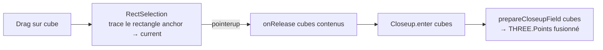

# RectSelection

::: tip Composition sandbox
Comme `MeasureTool`, `RectSelection` vit dans `playground/` — c'est une **composition** spécifique au sandbox, pas une primitive lib. Le code reste un exemple de référence pour implémenter un geste de marquee multi-cubes (style 4X / RTS).
:::

Sélection multi-cubes par rectangle. Le drag démarre sur un cube → le geste appartient à la sélection (pas de rotation orbite, pas de clic-single). Un rectangle aligné aux axes de la grille est tracé entre le cube **anchor** (cube initial) et le cube **current** (sous la souris). Au relâcher, le close-up s'ouvre sur tous les cubes contenus dans le rectangle.

## Signature

```ts
import { createRectSelection } from 'galex-js/playground/RectSelection';

createRectSelection(deps: RectSelectionDeps): RectSelection;

type RectSelectionDeps = {
  canvas: HTMLElement;
  controls: OrbitControls;        // désactivé pendant le geste
  cubeSize: number;               // taille des wireframes du pool
  parent: THREE.Object3D;         // attache initiale du pool — re-set via setParent
  pickCubeAt: (canvasX, canvasY) => Cube | null;
  cubeCenterAt: (i, j, k) => { x, y, z };
  getSelectableCube: (i, j, k) => Cube | null;
};

type RectSelection = {
  bind(handlers: { onRelease: (cubes: readonly Cube[]) => void }): void;
  setParent(parent: THREE.Object3D): void;  // après regen
  clear(): void;                            // au regen / sur abandon
};
```

## Geste utilisateur

| Action | Effet |
|---|---|
| Clic gauche sur **vide** + drag | Rotation orbite (passe à travers, OrbitControls owns the gesture) |
| Clic gauche sur **cube** + drag | Sélection rectangulaire — rectangle tracé entre anchor et current |
| Drag sur le vide pendant le geste | Le rectangle reste figé sur le dernier cube survolé |
| Relâcher | `onRelease(cubes)` — tous les cubes sélectionnables dans le rectangle |
| Clic court sur cube (pas de drag) | 1 seul cube remonté — close-up cube unique |

## Rendu pendant le drag

Trois rôles visuels, tous en **blanc** pour rester neutre vis-à-vis des highlights joueur/équipe :

| Rôle | Linewidth | Opacité | Cellules concernées |
|---|---|---|---|
| Endpoint (anchor + current) | `3` | `1.0` | 1 ou 2 cellules — bien visible |
| Outline | `1.5` | `0.28` | périmètre du rectangle, excluant les endpoints |
| Intérieur | — | — | non rendu (lisibilité du geste) |

Anchor et current peuvent coïncider (rectangle 1×1) → un seul endpoint est affiché, le pool sait éviter le doublon.

## Décisions d'architecture

### Rectangle planaire (j figé)

Le plateau du sandbox vit dans `j = 0` (`grid.fillDisk({ radius, j: 0 })`). `rectBox` ignore donc `current.j` et fige tout sur le plan de l'anchor — un drag accidentel qui traverse un autre niveau ne casse pas la géométrie du rectangle.

```ts
export function rectBox(anchor, current): RectBox {
  return {
    minI: Math.min(anchor.i, current.i),
    maxI: Math.max(anchor.i, current.i),
    minK: Math.min(anchor.k, current.k),
    maxK: Math.max(anchor.k, current.k),
    j: anchor.j,
  };
}
```

### Helpers purs et testables

`rectBox`, `outlineCoords`, `cubesInBox` n'ont aucune dépendance Three ou DOM — ils sont couverts par [`RectSelection.test.ts`](https://github.com/cedric-pouilleux/galex-js/blob/main/playground/RectSelection.test.ts) sans montage. Le wiring DOM / pool de wireframes est isolé dans la factory.

### Capture phase + `stopImmediatePropagation`

Le `pointerdown` est enregistré en **capture phase** (`addEventListener(..., true)`) — il tourne avant les handlers en bubble phase d'OrbitControls et de `Picker`.

Si le pointeur descend sur un cube sélectionnable :

1. `controls.enabled = false` — OrbitControls bail au check d'entrée, pas de rotation
2. `e.stopImmediatePropagation()` — `Picker` ne stocke pas `downX/downY/downT`, son `onClick` ne pourra pas fire au relâcher
3. `setPointerCapture(e.pointerId)` — garantit que `pointerup` arrive sur le canvas même si l'utilisateur sort des bords (sinon `active` resterait `true`)

Si le pointeur descend sur du vide, on sort tôt sans toucher à l'événement → OrbitControls + Picker fonctionnent normalement.

### Deux pools de wireframes

Endpoints et outline ont des matériaux différents (linewidth + opacité). On garde donc **deux** `LineSegments2` pools — chacun grandit paresseusement, se réutilise entre gestes, et la mise à jour entre frames se limite à `wire.position.set(...)` + `wire.visible = true`.

### Hover vide → état figé

`pointermove` au-dessus du vide ne réinitialise pas `current`. Le rectangle reste sur le dernier cube valide — comportement le plus stable visuellement et conforme à l'attente utilisateur (`onRelease` au-dessus du vide finalise sur le dernier cube survolé).

### Sélection finale = cubes existants visibles

`cubesInBox` consulte `getSelectableCube` (cube existant **et** visible sous le fog). Le rectangle peut donc englober des trous (cubes manquants) ou des zones non explorées sans les remonter à `onRelease`.

### Highlights cachés avant `onRelease`

Le close-up applique `setDimming(0.03)` à la galaxie. Les wireframes ont `depthTest: false` — ils continueraient à percer le dim si on les laissait visibles. On cache tout avant de notifier le host.

## Cycle de vie

Le composable vit aussi longtemps que la page — il survit aux régénérations de galaxie. Le host appelle :

- `setParent(newGalaxyScene.object3D)` après regen pour ré-attacher le pool sous la nouvelle scène
- `clear()` si une régénération arrive en plein geste (purge l'anchor et masque les visuels)

## Exemple d'intégration

Extrait de [`playground/Main.ts`](https://github.com/cedric-pouilleux/galex-js/blob/main/playground/Main.ts) :

```ts
const rectSelection = createRectSelection({
  canvas,
  controls,
  cubeSize: currentWorld.galaxyData.opts.cubeSize,
  parent: currentWorld.galaxyScene.object3D,
  pickCubeAt: (x, y) => {
    // Désactivé pendant le close-up et le mode mesure.
    if (currentWorld.closeup.isActive()) return null;
    if (measureTool.isEnabled()) return null;
    const { galaxyScene, galaxyData, player } = currentWorld;
    const cube = picker.pickCubeAt(x, y, activeCamera(), galaxyScene.object3D, galaxyData.grid);
    if (!cube) return null;
    return fog.status(cube, player) === 'visible' ? cube : null;
  },
  cubeCenterAt: (i, j, k) =>
    currentWorld.galaxyData.grid.cubeToWorldCenter(i, j, k),
  getSelectableCube: (i, j, k) => {
    const cube = currentWorld.galaxyData.grid.get(i, j, k);
    if (!cube) return null;
    return fog.status(cube, currentWorld.player) === 'visible' ? cube : null;
  },
});

rectSelection.bind({ onRelease: openCloseupForCubes });
```

Au regen :

```ts
setCurrentWorld: (w) => {
  currentWorld = w;
  rectSelection.setParent(w.galaxyScene.object3D);
},
onRequestRegen: () => {
  rectSelection.clear();
  regenerate();
}
```

## Composition avec le close-up

`RectSelection.onRelease` fournit `readonly Cube[]` — directement consommable par `Closeup.enter(cubes, …)` côté playground, qui appelle [`prepareCloseupField(cubes, …)`](./closeup#prepareloseupfield) côté lib. La lib fusionne les étoiles en un seul `THREE.Points` et expose `globalIndices` pour traduire un raycast local → index global.



## Pourquoi pas de la peinture ?

Une version antérieure « peignait » chaque cube survolé (un par un). Sur des galaxies denses, le geste était lent et imprécis — l'utilisateur devait passer effectivement sur chaque cube. Le rectangle est :

- **plus rapide** : un seul drag couvre une zone arbitraire,
- **plus prédictible** : la sélection est bornée par deux coordonnées, pas par le tracé du curseur,
- **plus lisible** : endpoints + outline donnent un retour visuel immédiat de la forme,
- **cohérent avec les conventions 4X / RTS** : marquee classique.

Le composable lib (`prepareCloseupField`) ne change pas : il accepte un `Cube[]` sans se soucier d'où il vient.
